# Knowledge Graph as Agent Memory

A weekend experiment building structured agent memory using a Knowledge Graph.
Instead of storing conversation history as flat text, every fact the agent knows lives as a typed node and edge in Neo4j — queryable, traversable, and persistent across sessions.



---

## What this project explores

Most agent memory implementations store chat history in a list or embed everything into a vector store. This project takes a different approach — modeling memory as a **Knowledge Graph** where facts have structure, relationships have types, and the agent can reason across multiple hops.

Six memory types are implemented and tested:

| Memory Type | What it stores | Example |
|---|---|---|
| Semantic | Canonical world facts as triples | `(boleto)-[IS_A]→(PaymentInstrument)` |
| Transactional | Orders, items, payments | Customer → Order → Product → Seller chain |
| Temporal | Time-bounded facts, delivery patterns | Late deliveries, purchase timelines |
| Behavioral | Payment patterns, category habits | Derived from transactional history |
| Emotional | Review sentiment per customer | Positive / neutral / negative labels |
| Episodic | Conversation sessions | Session nodes linked to topics and customer |

---

## Dataset

**Brazilian E-Commerce Public Dataset by Olist** — available on [Kaggle](https://www.kaggle.com/datasets/olistbr/brazilian-ecommerce)

~100k real orders across 9 CSV files. A 1000-customer sample is used for experimentation.

```
olist_customers_dataset.csv
olist_orders_dataset.csv
olist_order_items_dataset.csv
olist_order_payments_dataset.csv
olist_order_reviews_dataset.csv
olist_products_dataset.csv
olist_sellers_dataset.csv
olist_geolocation_dataset.csv
product_category_name_translation.csv
```

---

## Graph Schema

```
(Customer)-[:PLACED]→(Order)
(Order)-[:HAS_ITEM]→(OrderItem)
(OrderItem)-[:IS_PRODUCT]→(Product)
(OrderItem)-[:FULFILLED_BY]→(Seller)
(Order)-[:PAID_WITH]→(PaymentMethod)
(Customer)-[:WROTE]→(Review)-[:ABOUT]→(Order)
(Product)-[:BELONGS_TO]→(Category)
(Customer)-[:LOCATED_IN]→(City)
(Session)-[:INVOLVED_CUSTOMER]→(Customer)
(Session)-[:DISCUSSED_TOPIC]→(Topic)
```

> Note: The seller relationship is at the **item level**, not the order level.
> A single order can contain items from multiple sellers.

---

## Stack

| Component | Technology |
|---|---|
| Knowledge graph | Neo4j Desktop |
| Graph queries | Cypher |
| Agent orchestration | LangGraph |
| LLM | LLaMA3 via Ollama (local) |
| LLM framework | LangChain (`langchain-ollama`) |
| Data processing | Python, Pandas |
| Graph driver | `neo4j` Python driver |

---

## Project files

```
├── olist_neo4j_load.ipynb              # Load Olist CSV data into Neo4j
├── memory_retriever.py                 # MemoryRetriever class — one method per memory type
├── memory_reterival.ipynb              # Test each retriever method interactively
├── langgraph_agent.ipynb               # Full LangGraph agent with conditional routing
├── agent_memory_need_to_need_flow.svg  # End-to-end flow diagram (user perspective)
├── agent_memory_ai_engineering_architecture.svg  # Technical architecture diagram
└── README.md
```

---

## Architecture

### End-to-end flow



### How the agent routes

```
User message
     ↓
extract_entities     ← LLaMA3 extracts customer_id + intent label
     ↓
route_intent         ← Python reads intent, returns node name
     ↓
retrieve_[type]      ← one of 6 Neo4j query nodes fires
     ↓
reason               ← LLaMA3 synthesizes answer from memory context
     ↓
write_episode        ← Session node written to Neo4j
     ↓
Response
```

LangGraph does not make the routing decision — LLaMA3 does.
LangGraph executes the map: `intent string → retrieval node`.

---

## Setup

### Prerequisites

- Neo4j Desktop installed and running
- Ollama installed with LLaMA3 pulled
- Python 3.10+

### Install dependencies

```bash
pip install neo4j pandas langgraph langchain-ollama langchain-core
```

### Start Ollama

```bash
ollama pull llama3
ollama serve
```

### Neo4j connection

Update credentials in both `memory_retriever.py` and the agent notebook:

```python
NEO4J_URI      = "bolt://127.0.0.1:7687"
NEO4J_USER     = "neo4j"
NEO4J_PASSWORD = "your_password"
```

---

## Running the project

**Step 1 — Load data into Neo4j**

Open `olist_neo4j_load.ipynb` and run all cells.
Downloads the Olist CSVs, samples 1000 customers, and loads the full graph schema into Neo4j.

Verify in Neo4j Browser (`http://localhost:7474`):
```cypher
MATCH (n) RETURN labels(n) AS type, count(n) AS count ORDER BY count DESC
```

**Step 2 — Test the memory retriever**

Open `memory_reterival.ipynb`. Get a real customer ID:
```cypher
MATCH (c:Customer) RETURN c.unique_id LIMIT 5
```
Paste it into the notebook and run each memory type method individually.

**Step 3 — Run the agent**

Open `langgraph_agent.ipynb`. Paste the same customer ID and run the test conversations — one per memory type:

```python
agent.chat("What orders has customer <id> placed?")           # transactional
agent.chat("Were any orders for <id> delivered late?")        # temporal
agent.chat("How does customer <id> usually pay?")             # behavioral
agent.chat("What is the review sentiment for customer <id>?") # emotional
agent.chat("What is boleto as a payment method?")             # semantic
agent.chat("Give me a full profile of customer <id>")         # full
```

After each conversation, check episodic memory was written:
```cypher
MATCH (s:Session)-[:DISCUSSED_TOPIC]→(t:Topic)
RETURN s.session_id, s.intent, s.timestamp, collect(t.name) AS topics
```

---

## Key design decisions

**Why Neo4j over a vector store for memory?**

A vector store answers: *"what is semantically similar to this query?"*
A Knowledge Graph answers: *"what is structurally connected to this entity?"*

For agent memory, the KG is the reasoning layer. Multi-hop queries like
*"which seller did this customer buy from most, and did they leave a negative review about that seller?"*
are natural graph traversals — painful in a vector store.

Neo4j also supports surgical updates: changing one fact = updating one node or edge. No re-embedding.

**Embeddings + KG together**

Embeddings are not excluded — they belong on node properties for fuzzy entry-point lookup.
The pattern is: embed the query → find the anchor node → traverse the graph from there.

---

## What's next

- [ ] Add embedding vectors on node properties for fuzzy retrieval
- [ ] Add fallback routing — if retrieved context is empty, re-route to `retrieve_full`
- [ ] Build a conversational loop that persists `customer_id` across turns
- [ ] Add preference memory update — agent writes new preferences back to graph after each session
- [ ] Explore GraphRAG on top of this schema

---

## References

- [Olist Dataset — Kaggle](https://www.kaggle.com/datasets/olistbr/brazilian-ecommerce)
- [LangGraph documentation](https://langchain-ai.github.io/langgraph/)
- [Neo4j Python driver](https://neo4j.com/docs/python-manual/current/)
- [Ollama](https://ollama.com)
