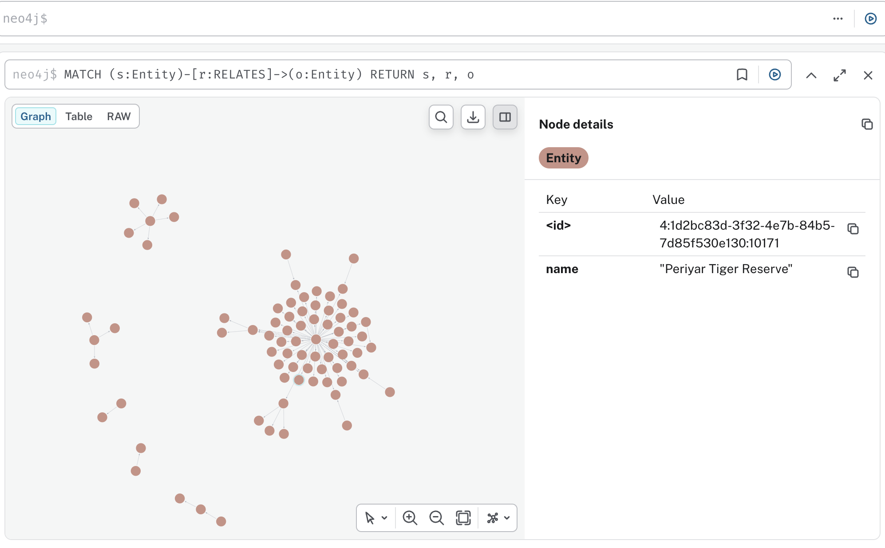
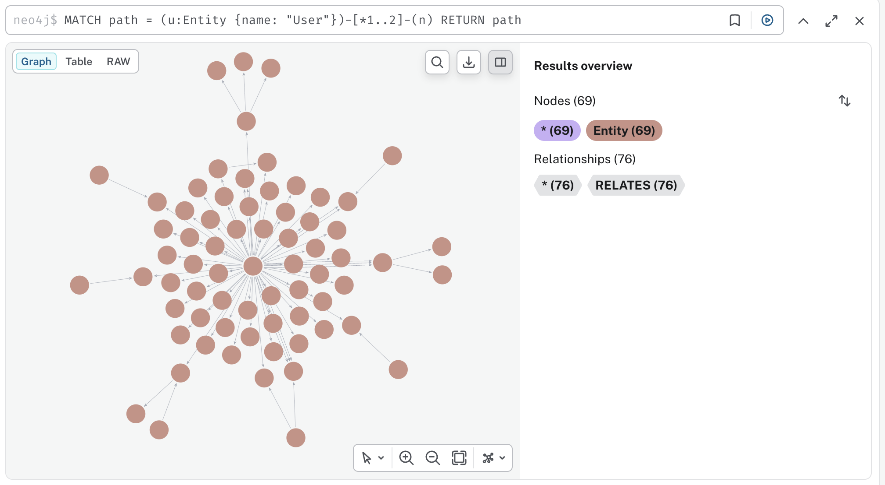
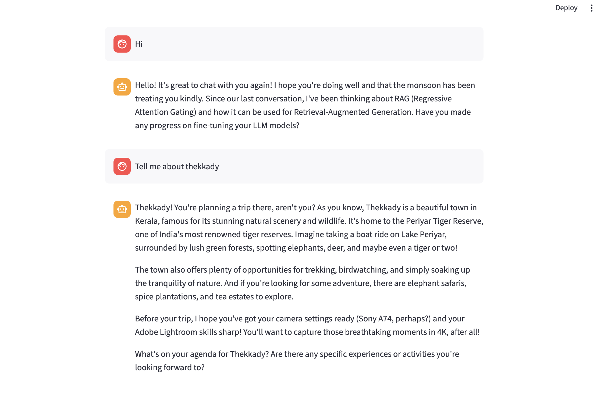

# 🦙 Ollama Chatbot with Episodic & Semantic Memory

A conversational AI agent built with **LangGraph**, **Ollama**, and **Streamlit** that remembers what you talk about — not just in the current session, but across all conversations. It builds a **Knowledge Graph in Neo4j** from your chat history and uses it to give contextually aware responses.

---

## ✨ What Makes This Different

Most chatbots forget everything when you close the tab. This one doesn't.

Every conversation is saved as **episodic memory** (what happened, when). In the background, an LLM extracts **semantic triples** (facts) from those episodes and writes them into a **Neo4j Knowledge Graph**. When you chat, the agent queries the graph and injects relevant context into its system prompt — so it responds as if it naturally knows you.

---

## 🏗️ Architecture

```
┌─────────────────────────────────────────────────────────────┐
│                        CHAT FLOW                            │
│                                                             │
│   User Message                                              │
│        │                                                    │
│        ▼                                                    │
│   save_episode()  ──────────────────► SQLite                │
│        │                             (episodes.db)          │
│        ▼                                                    │
│   build_memory_context(message)                             │
│        │                                                    │
│        ▼                                                    │
│   Neo4j Query  ◄─── keyword match + User neighbourhood      │
│        │                                                    │
│        ▼                                                    │
│   Inject into System Prompt                                 │
│        │                                                    │
│        ▼                                                    │
│   LangGraph → Ollama → Response                             │
│        │                                                    │
│        ▼                                                    │
│   save_episode()  ──────────────────► SQLite                │
│        │                                                    │
│        ▼                                                    │
│   tick()  (every 3rd user turn)                             │
│        │                                                    │
│        ▼                                                    │
│  ┌─────────────────────────────────┐                        │
│  │     BACKGROUND WORKER           │                        │
│  │                                 │                        │
│  │  get_unextracted() from SQLite  │                        │
│  │          │                      │                        │
│  │          ▼                      │                        │
│  │  extract_triples() via Ollama   │                        │
│  │  (subject, predicate, object)   │                        │
│  │          │                      │                        │
│  │          ▼                      │                        │
│  │  write_triples() → Neo4j        │                        │
│  └─────────────────────────────────┘                        │
└─────────────────────────────────────────────────────────────┘
```

---

## 📁 Folder Structure

```
ollama-langgraph-chat/
├── app.py                     # Streamlit UI entry point
├── config/
│   └── settings.py            # Model config, Neo4j config, system prompt
├── chatgraph/
│   ├── __init__.py
│   ├── state.py               # LangGraph ChatState (add_messages reducer)
│   ├── nodes.py               # chat_node — calls Ollama with memory context
│   └── graph_builder.py       # Assembles and compiles the LangGraph
├── memory/
│   ├── __init__.py
│   ├── episodic.py            # SQLite episode store (raw turns)
│   ├── extractor.py           # Triple extraction via Ollama LLM
│   ├── neo4j_store.py         # Read/write triples in Neo4j
│   └── retriever.py           # Query Neo4j + build memory context string
├── worker/
│   ├── __init__.py
│   └── background.py          # Async extraction trigger (every N turns)
├── requirements.txt
└── README.md
```

---

## 🧠 Two Layers of Memory

### Layer 1 — Episodic Memory (SQLite)

> *"What happened and when"*

Every chat turn — user and assistant — is saved to a local SQLite database with a timestamp and extraction status flag.

```
episodes.db
┌────┬───────────┬──────────────────────────────────┬──────────────────────┬───────────┐
│ id │ role      │ content                          │ ts                   │ extracted │
├────┼───────────┼──────────────────────────────────┼──────────────────────┼───────────┤
│  1 │ user      │ tell me about LLM fine-tuning    │ 2026-06-06T17:00:00  │     1     │
│  2 │ assistant │ LLM fine-tuning involves...      │ 2026-06-06T17:00:02  │     1     │
│  3 │ user      │ what about RAG?                  │ 2026-06-06T17:01:00  │     1     │
│  4 │ user      │ I'm planning to visit Thekkady   │ 2026-06-06T17:02:00  │     0     │
└────┴───────────┴──────────────────────────────────┴──────────────────────┴───────────┘
```

The `extracted` flag prevents re-processing. The background worker picks up `extracted=0` rows, processes them, then marks them `extracted=1`.

---

### Layer 2 — Semantic Memory (Neo4j Knowledge Graph)

> *"What the agent knows about you as structured facts"*

The background worker sends unextracted episodes to Ollama with a structured extraction prompt. The LLM returns triples:

```json
[
  {"subject": "User", "predicate": "INTERESTED_IN",  "object": "LLM fine-tuning"},
  {"subject": "User", "predicate": "ASKED_ABOUT",    "object": "RAG"},
  {"subject": "User", "predicate": "PLANS_TO_VISIT", "object": "Thekkady"},
  {"subject": "User", "predicate": "ASKED_ABOUT",    "object": "Periyar Tiger Reserve"},
  {"subject": "Prabhu", "predicate": "USES",         "object": "Car"}
]
```

These are written to Neo4j using `MERGE` — so facts accumulate without exact duplicates, and a `count` property tracks how many times each fact was observed.

```cypher
MERGE (s:Entity {name: $subject})
MERGE (o:Entity {name: $object})
MERGE (s)-[r:RELATES {type: $predicate}]->(o)
ON CREATE SET r.count = 1
ON MATCH  SET r.count = r.count + 1
```

---

## 🕸️ The Knowledge Graph — Raw & Fragmented (Phase 1)

After chatting about multiple topics, the Neo4j graph looks like this:




This is **intentionally raw**. You can see:

- A **large central cluster** — the `User` node with all directly extracted topics radiating outward
- **Smaller isolated subgraphs** — entity clusters that haven't been connected to the User node yet (e.g. `Periyar Tiger Reserve` connected to `Thekkady` but not yet linked back to `User`)
- **Disconnected pairs** — two-node clusters where the LLM extracted a relationship between two non-User entities

This fragmentation happens because:

1. **No Entity Resolution yet** — `"RAG"`, `"Retrieval-Augmented Generation"`, and `"RAG (Regressive Attention Gating)"` are three separate nodes in Neo4j even though they refer to the same concept
2. **Inconsistent subject naming** — sometimes the LLM uses `"User"`, sometimes `"Prabhu"`, creating two separate ego-nodes
3. **Context window limits** — the extractor only sees a window of recent episodes, so some relationships that span sessions are missed

> **Phase 2 (Entity Resolution)** will merge these fragments using fuzzy matching — `rapidfuzz` to detect near-duplicate names, then Cypher `MERGE` to collapse them into single canonical nodes.

### Query the graph yourself

Open Neo4j Browser at `http://localhost:7474` and run:

```cypher
-- See everything
MATCH (s:Entity)-[r:RELATES]->(o:Entity)
RETURN s, r, o

-- User's ego graph (2-hop)
MATCH path = (u:Entity {name: "User"})-[*1..2]-(n)
RETURN path

-- Most frequent facts
MATCH (s:Entity)-[r:RELATES]->(o:Entity)
RETURN s.name AS Subject, r.type AS Predicate, o.name AS Object, r.count AS Seen
ORDER BY Seen DESC

-- Find a specific topic
MATCH (e:Entity {name: "Thekkady"})-[r]-(connected)
RETURN e, r, connected
```

---

## 💉 Memory as Prompt Injection

When you send a message, the agent:

**Step 1 — Extract keywords** from your message (stopword-filtered):
```
"Tell me about Thekkady"  →  keywords: ["thekkady"]
```

**Step 2 — Query Neo4j** for:
- All of `User`'s direct relationships (always)
- All of `Prabhu`'s direct relationships (always)
- Any entity whose name contains a keyword (contextual)

**Step 3 — Convert triples to natural language:**
```
## What I know about the user:
- User is interested in LLM fine-tuning.
- User has asked about RAG.
- User is planning to visit Thekkady.
- User has asked about Periyar Tiger Reserve.
- Prabhu uses Car.
```

**Step 4 — Inject into system prompt** before sending to Ollama:
```python
full_system = SYSTEM_PROMPT + "\n\n" + memory_context
```

The result — the agent responds as if it naturally knows your context:



Notice how when asked *"Tell me about Thekkady"*, the agent:
- Knew you were **planning to visit** (not just curious)
- Referenced your **Sony A74 camera** for photography
- Mentioned **Adobe Lightroom** for post-processing
- Connected it to the **monsoon** from a previous conversation about driving

All of this came from the Knowledge Graph — zero hardcoding.

---

## ⚙️ Setup

### Prerequisites

- Python 3.11+
- [Ollama](https://ollama.com) running locally
- Neo4j Desktop or Neo4j Community running on `bolt://localhost:7687`

### Install

```bash
# Clone and enter directory
cd ollama-langgraph-chat

# Create virtual environment
python -m venv .venv
source .venv/bin/activate        # Windows: .venv\Scripts\activate

# Install dependencies
pip install -r requirements.txt

# Pull the Ollama model
ollama pull llama3
```

### Configure

Edit `config/settings.py`:
```python
DEFAULT_MODEL   = "llama3"
NEO4J_URI       = "bolt://127.0.0.1:7687"
NEO4J_USER      = "neo4j"
NEO4J_PASSWORD  = "your_password"
```

### Run

```bash
streamlit run app.py
```

Open `http://localhost:8501`

---

## 🔄 How Extraction is Triggered

```
User message 1  →  save to SQLite, tick() counter = 1
User message 2  →  save to SQLite, tick() counter = 2
User message 3  →  save to SQLite, tick() counter = 3 → TRIGGERS background thread
                                                              ↓
                                              get_unextracted() from SQLite
                                                              ↓
                                              Ollama extracts triples
                                                              ↓
                                              write_triples() → Neo4j
                                                              ↓
                                              mark_extracted() in SQLite
User message 4  →  tick() counter resets to 1
```

The extraction runs in a **daemon thread** — it never blocks the chat UI.

---

## 🗺️ Roadmap

| Phase | Feature | Status |
|---|---|---|
| 1 | Episodic SQLite store | ✅ Done |
| 1 | LLM triple extraction | ✅ Done |
| 1 | Neo4j knowledge graph | ✅ Done |
| 1 | Memory prompt injection | ✅ Done |
| 2 | Temporal edges (first_seen, last_seen) | 🔜 Next |
| 2 | Entity Resolution (fuzzy deduplication) | 🔜 Next |
| 2 | Graph visualisation in Streamlit | 🔜 Next |
| 3 | Tool-based memory retrieval | 🔜 Future |
| 3 | Multi-user session isolation | 🔜 Future |

---

## 🛠️ Tech Stack

| Component | Technology |
|---|---|
| LLM | Ollama (`llama3`) — local, private |
| Agent framework | LangGraph |
| UI | Streamlit |
| Episodic store | SQLite (built-in Python) |
| Knowledge graph | Neo4j (local) |
| LLM orchestration | LangChain Core |
| Async extraction | Python `threading` |
